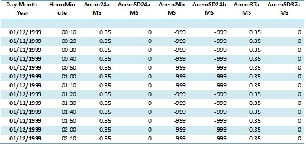
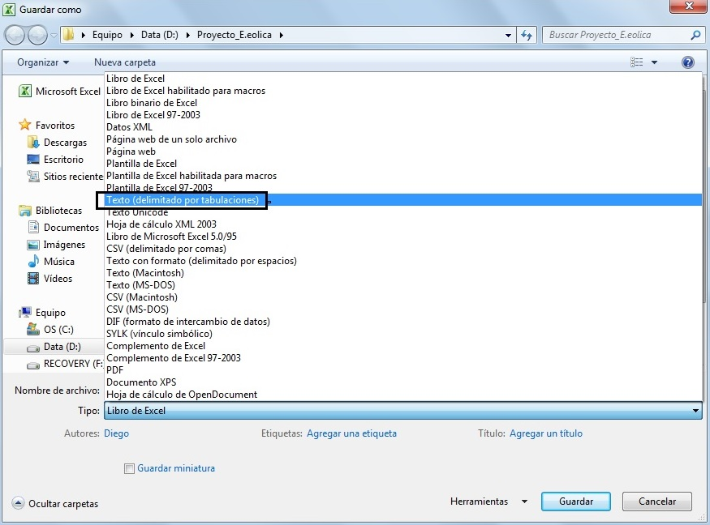

# Resumen
En este trabajo se presenta el paquete WindResource para el software estadístico libre R. Se trata de la primera versión de del software actualmente en desarrollo en el marco del proyecto UTN 1894.  
Este paquete incluye funciones para el estudio del recurso eólico. Mediante estas funciones es posible realizar un análisis descriptivo exhaustivo de las características del viento. Estos análisis son imprescindibles a la hora de evaluar el potencial de un determinado sitio donde se pretenda instalar aerogeneradores con fines energéticos.  
El software permite análisis de frecuencias de velocidad y dirección, ajustar distribuciones, y obtener proyecciones de la energía anual generada.  
Para simplificar la operación del paquete, se ha integrado al mismo una interfaz web utilizando el paquete Shiny.  
Se describen en este trabajo las principales características funcionales de esta primera versión del software.

# R y el paquete WindResource
El paquete estadístico R es un entorno informático estadístico que incluye herramientas de análisis de datos y generación de gráficas. Es software libre y funciona bajo Windows, MAC OS y Linux.
El R puede descargarse de http://www.r-project.org/. Para aquellos que recién se inician, es altamente recomendable instalar además el RStudio, como framework de desarrollo amigable (http://www.rstudio.com/).

El código fuente de la versión en desarrollo se encuentra disponible en **GitHub: https://github.com/mbonoli/WindResource**. 

Para instalar el paquete en R primeramente se debe utilizar el comando `install_github` disponible en el paquete devtool para abrir la conexión.

En el caso de no tener el paquete devtools, se lo debe instalar y cargar en memoria de la siguiente manera:

```{r, eval=FALSE}
install.packages("devtools")
library(devtools)
```

Una vez instalado el paquete requerido, se debe abrir la conexión con el servidor **github**:

```{r, eval=FALSE}
install_github("mbonoli/WindResource")
```

Luego instalar **WindResource** en R:

```{r, eval=FALSE}
install.packages("https://github.com/mbonoli/WindResource.git")
```

y cargarlo en memoria de la siguiente manera:

```{r, message=FALSE}
library(WindResource)
```

De esta manera ya se encuentraría el paquete instalado y listo para ser utilizado.

## Alternativa web
Para aquellas personas que no estén familiarizadas con R, y deseen utilizar el software, es conveniente el uso de la interfaz web desarrollada a tal fin.
Una versión onlinede este software se encuentra en: https://mbonoli.shinyapps.io/WindResource

## Setup de datos para su uso con WindResource

Para ejemplificar, utilizaremos los datos provenientes de una torre de medición situada en Massachusetts.
La información acerca del origen de los datos se encuentra disponible en al siguiente dirección: 
[http://www.umass.edu/windenergy/resourcedata/Mt_Tom_Holyoke](http://www.umass.edu/windenergy/resourcedata/Mt_Tom_Holyoke). En particular trabajaremos con el set de datos del período 1999-2002, almacenado en el archivo: 
[http://www.umass.edu/windenergy/sites/default/files/downloads/data/MtTom-0032_1999-12-01_2002-12-31.dat](http://www.umass.edu/windenergy/sites/default/files/downloads/data/MtTom-0032_1999-12-01_2002-12-31.dat). 

Una vez descargado el archivo debemos darle formato de manera de poder importarlo al R como data.frame, es decir una primera fila con los nombres de las variables y a continuación los registros con la información propiamente dicha.

Otra opción para trabajar con la base de datos de ejemplo, es bajarla desde la siguiente dirección **xxxxx** y guardarla en una determinada carpeta. La base se encuentra en un formato .xlsx.

A modo de ejemplo se muestran las primeras filas de la base de ejemplo en formato Excel:  

<p><center></center></p>

Obtenido los datos en formato .xlsx, se debe hacer un segundo procedimiento, guardar la base en un formato de texto, para luego poder ser importada al R; se sugiere utilizar un formato de separación por tabulación. En el momento que se guarda la base como texto, es imprescindible recordar la ruta de acceso al archivo para luego indicársela al programa.

Para obtener el formtato sugerido anteriormente, se le debe indicar al programa Excel que guarde el archivo como **Texto(delimitado por tabulaciones)**, como lo muestra la siguiente imagen:

<center></center>

## Importación de la base de datos a R


La base en formato de texto debe ser importada dentro del espacio de trabajo R.
Hay diferentes maneras de hacerlo, dependiendo del formato que tengan los datos.

Para la base de ejemplo que se está utilizando debe hacerse de la siguiente manera, indicando la ruta de acceso al archivo:

```{r}
MtTom <- read.delim("D:/MtTom-0032_1999-12-01_2002-12-31.txt")
```

Se puede observar la estructura predicha pidiendo a R que nos muestre los 3 primeros registros de la base de datos importada:

```{r}
head(MtTom,4)
```

De esta manera se verifica que los datos se encuentran cargados en el espacio de trabajo de R como data.frame. 

## El comando `setwd()`

Las distintas funciones del paquete no trabajan con los datos tal como se cargaron, sino que es necesario hacerles un pre-procesamiento a través de la función `setwd()`. Esta función se encarga de tomar los datos del data.frame de entrada y generar un nuevo "objeto" que contiene la estructura jerárquica necesaria. La función tiene diferentes parámetros que aseguran una correcta configuración a la hora de mostrar los resultados. Estos parámetros son:

- **data**: Nombre del data.frame que contiene los datos originales.
- **name**: Nombre que se le desea dar a al dataset.
- **date.var**: Nombre de la variable que contiene las fechas de las mediciones. 
- **date.format**: Formato de la variable que contiene las fechas. Los formatos disponibles son:  YYYYMMDD,  YYYY-MM-DD,  YYYY.MM.DD  y  DD/MM/YYYY. 
- **time.var**: Nombre de la variable que incluye el horario de las mediciones. 
- **time.format**: Formato de la variable que contiene el horario de las mediciones. Los formatos disponibles son:  HHMM,  HHMMSS,  HH:MM,  HH:MM:SS, HH.MM, HH.MM.SS 
- **ane.names**: Vector con los nombres que se les desea dar a los distintos anemómetros.
- **ane.height**: Vector con las alturas (metros) a la que se encuentran los distintos anemómetros.
- **speed.ave.var**: Vector con los nombres de las variables que que contienen la velocidad media del viento de cada registro.
- **speed.min.var**: Vector con los nombres de las variables que que contienen la velocidad mínima del viento de cada registro.Si la base de datos no posee información sobre mediciones de velocidades mínimas, no es necesario configurar este parámetro porque la función lo toma por defecto com NA, sin datos.
- **speed.max.var**: Vector con los nombres de las variables que que contienen la velocidad máxima del viento de cada registro.Si la base de datos no posee información sobre mediciones de velocidades máximas, no es necesario configurar este parámetro porque la función lo toma por defecto como NA, sin datos.
- **speed.sd.var**: Vector con los nombres de las variables que contienen el desvío estándar de la velocidad del viento de cada registro. Si la base de datos no posee información sobre mediciones de los desvíos, no es necesario configurar este parámetro porque la función lo toma por defecto como NA, sin datos.
- **speed.unit**: Unidades en que se registra la velocidad del viento. Por defecto se establece que la unidad de medida es m/s.
- **dir.var**: Vector con los nombres de las variables que que contienen la dirección del viento en cada registro.
- **dir.unit**: Unidades en que se registra la dirección.Por defecto se establece que la unidad de medida es grados(deg).
- **temp.var**: Nombre de la variable que incluye la temperatura. Si la base de datos no contiene mediciones no es necesario configurar éste parámetro, por defecto la función lo toma como NA, sin información.  
- **temp.unit**: Unidades en que se registra la temperatura. Por defecto la unidad es Grados Celsius(C).
- **pres.var**: Nombre de la variable que incluye presión.Si la base no contiene mediciones no es necesario indicarlo, por defecto lo toma como NA, sin información.
- **pres.unit**: Unidades en que se registra la presión.Si no hay mediciones por defecto es NA.
- **NA.values**: Vector con los valores que deben considerarse perdidos en la base de datos.

Los parámetros `data`, `date.var`, `date.format`, `time.var`, `time.format`, `speed.ave.var` y `dir.var` son obligatorias, el resto es opcional.  

Para nuestro caso, se ejecuta el comando de la siguiente manera guardando el resultado en una nueva variable que llamamos **wdMtTom**. 
Además, durante su ejecución, la función brinda cierta información de cantidad de registros y datos de fecha y hora.  

```{r}
wdMtTom <- setWD (data = MtTom, 
                  name = "Data MtTom",
                  date.var = "Day.Month.Year", 
                  date.format = "DD/MM/YYYY", 
                  time.var ="Hour.Minute", 
                  time.format = "HH:MM",
                  ane.names = c("Anem24aMS","Anem24bMS","Anem37aMS","Anem37bMS"),
                  ane.height= c(24,24,37,37),
                  speed.ave.var = c("Anem24aMS","Anem24bMS","Anem37aMS","Anem37bMS"),
                  speed.min.var = NA,
                  speed.max.var = NA,
                  speed.sd.var = c("AnemSD24aMS","AnemSD24bMS","AnemSD37aMS","AnemSD37bMS"),
                  speed.unit = NA,
                  dir.var = c("Vane24aDEG","Vane24aDEG","Vane37aDEG","Vane37aDEG"),
                  dir.unit = "deg",
                  temp.var = "Etmp3aDEGC",
                  temp.unit = "C",
                  pres.var = NA,
                  pres.unit = NA,
                  NA.values = c(-988, -989, -991, -999))
```

El objeto **wdMtTom** es de clase **windata**, cuyo formato es el requerido para ejecutar las funciones del paquete.


# Comando `gen10m()`

La frecuencia de registros en las bases de datos extraídas de los anemómetros puede tomar distintos valores. En general, se trabaja intervalos que van de 1 minuto a una hora. Más allá de esto, muchos análisis requieren por norma frecuencias establecidas determinadas. Para molinos de alta potencia, los análisis requieren frecuencias diezminutales (un registro cada 10 minutos).
El paquete WindResource permite trabajar con cualquier intervalo de tiempo entre registros, pero muchas veces es necesario convertir una serie de datos minutal en una serie diezminutal. Este proceso de agrupamiento tiene algunas particularidades en el cálculo de la varianza que requieren cierto estudio. Para estos casos se ha incluido la función gen10m() que toma un conjunto de datos generados con una frecuencia mayor a 10 minutos y los convierte a datos diezminutales utilizando el procedimiento previsto en la norma IEC 61400-12.
Su uso es sencillo, en el siguiente ejemplo, se toma un conjunto de datos minutal, se lo conviente a diezminutal y se lo guarda en la variable wd10. 

```{r, eval=F}
wd10 <- gen10m(data = wd)
```


